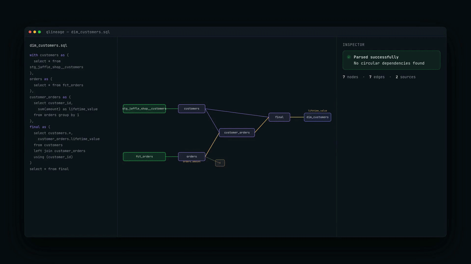
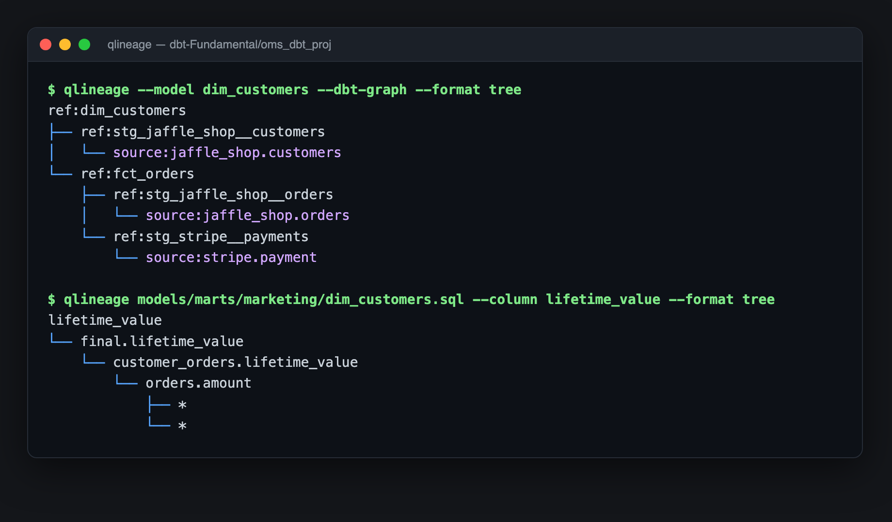
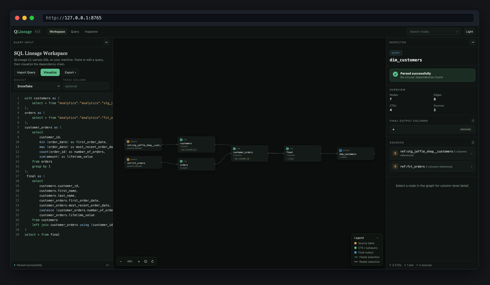
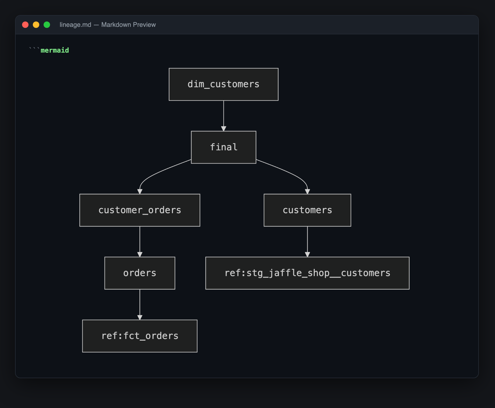

# Snowflake and DuckDB



This is the same dbt project with two targets in `oms_dbt_proj/profiles.yml`. Models, sources, and tests are shared; only the target changes.

- **DuckDB** (`--target duckdb`) — default. Runs locally with no warehouse login. Load raw data with `python duckdb/load_raw.py`, then models land in `duckdb/analytics.duckdb`.
- **Snowflake** (`--target snowflake`) — same models and sources. Load raw data with `snowflake/raw_data.sql`, then set `SNOWFLAKE_ACCOUNT`, `SNOWFLAKE_USER`, and `SNOWFLAKE_PASSWORD`.

From `oms_dbt_proj`:

```sh
dbt build --profiles-dir . --target duckdb
dbt build --profiles-dir . --target snowflake
```

Setup details are in `oms_dbt_proj/README.md`.

## DuckDB UI

After a local DuckDB build, launch the UI from the repo root to query models in the browser:

```sh
python duckdb/ui.py
```

That opens http://localhost:4213 against `duckdb/analytics.duckdb` and attaches `duckdb/raw.duckdb` as `raw`. Models use a 3-part name (`database.schema.table`) because the DuckDB file and the dbt schema are both called `analytics`:

```sql
select * from analytics.analytics.dim_customers;
select * from analytics.analytics.fct_orders;
select * from raw.jaffle_shop.customers;
```

Keep the process running while you use the UI. Press Ctrl+C to stop it.

## Lineage with QLineage

[`qlineage-cli`](https://pypi.org/project/qlineage-cli/) reads lineage out of this project without connecting to a warehouse. It parses SQL locally with SQLGlot and picks up `target/manifest.json` when it exists, so it works against the DuckDB target, the Snowflake target, or no target at all.

It is already in `requirements.txt`:

```sh
uv pip install -r requirements.txt
```

Compile first so the manifest exists, then run everything from `oms_dbt_proj`:

```sh
cd oms_dbt_proj
dbt compile --profiles-dir .
```

Without a manifest `qlineage` falls back to parsing `ref()` and `source()` out of the raw SQL, which still works but cannot resolve sources or follow the DAG past the first hop.

### Terminal output

`--dbt-graph` walks the model DAG back to sources, and `--column` traces a single column through the CTEs:

```sh
qlineage --model dim_customers --dbt-graph --format tree
qlineage models/marts/marketing/dim_customers.sql --column lifetime_value --format tree
```



Passing a file path instead of `--model` shows the CTE structure inside that one model rather than the project DAG.

The `*` leaves under `orders.amount` are expected. Our staging models use `select *`, and with no live warehouse connection there is no schema to expand the star against, so the column trace stops there.

### Browser workspace

Passing a SQL file with no `--format` starts a local server on `127.0.0.1` and opens the workspace:

```sh
qlineage models/marts/marketing/dim_customers.sql
```



The left pane holds the compiled SQL and re-parses when you edit and press Visualize. The canvas pans and zooms. The inspector on the right reports parse status, node and edge counts, output columns, and the sources feeding the model; selecting a node drills into its columns and join keys. The workspace also exports SVG, PNG, and JSON. Press Ctrl+C in the terminal to stop the server.

Use `qlineage ui` for a blank workspace to paste ad-hoc SQL into, and `--port` if 8765 is taken.

### Mermaid for docs

`--format mermaid` prints a diagram you can paste straight into a markdown file:

```sh
qlineage models/marts/marketing/dim_customers.sql --format mermaid
```



GitHub renders a fenced ` ```mermaid ` block natively. For the same preview inside Cursor or VS Code, install the `bierner.markdown-mermaid` extension and open the preview with Cmd+Shift+V. To turn a diagram into an image file instead:

```sh
npx @mermaid-js/mermaid-cli -i lineage.mmd -o lineage.png -b white -s 3
```

### Useful flags

| Flag | Description |
|------|-------------|
| `--model <name>` | Select a dbt model by name; works without a file path |
| `--dbt-graph` | Show the recursive model and source DAG instead of CTE lineage |
| `--column <name>` | Trace one output column through the query |
| `--format tree\|json\|mermaid\|html` | `html` opens the workspace; the rest print to the terminal |
| `--dialect snowflake\|redshift` | Parser dialect, defaults to `snowflake` |
| `--depth N` | Cap how far `--dbt-graph` walks |
| `--manifest <path>` | Point at a manifest explicitly instead of auto-discovering |
| `--no-dbt` | Ignore the manifest and parse the raw SQL only |
| `-o, --output <path>` | Write the rendered lineage to a file instead of stdout |
| `--version` | Print the installed version (added in 0.2.2) |


# common dbt Commands
## 1. Running and Building Models
| Command                      | Description |
|------------------------------|-------------|
| `dbt run`                    | Executes models by running SQL queries and materializing results in the data warehouse. |
| `dbt build`                  | Runs `dbt run`, `dbt test`, and `dbt source freshness` in a single command. |
| `dbt run --select <model>`   | Runs a specific model instead of all models in the project. |
| `dbt run --exclude <model>`  | Runs all models except the specified one. |
| `dbt run --full-refresh`     | Forces a full refresh for incremental models. |
| `dbt run --select state:modified+` | Runs only the models that have been modified since the last run. |
| `dbt retry`                  | Retries failed models a specified number of times from the last point of failure. |

## 2. Testing and Validating Data
| Command                      | Description |
|------------------------------|-------------|
| `dbt test`                   | Runs all tests on models to validate data integrity. |
| `dbt test --data`            | Runs only data tests (e.g., uniqueness, referential integrity). |
| `dbt test --schema`          | Runs only schema tests (e.g., constraints on table structures). |
| `dbt test --select <model>`  | Runs tests only on a specific model. |

## 3. Data Freshness and Snapshots
| Command                      | Description |
|------------------------------|-------------|
| `dbt source freshness`       | Checks the freshness of source data by comparing last updated timestamps. |
| `dbt source snapshot-freshness` | Alias for `dbt source freshness`, checking source freshness. |
| `dbt snapshot`               | Captures changes in slowly changing dimensions (SCD) over time. |
| `dbt snapshot --select <snapshot>` | Runs a specific snapshot instead of all snapshots. |

## 4. Documentation and Exploration
| Command                      | Description |
|------------------------------|-------------|
| `dbt docs generate`          | Generates documentation, including model descriptions and lineage graphs. |
| `dbt docs serve`             | Starts a local web server to serve dbt-generated documentation. |
| `dbt ls`                     | Lists all models, tests, sources, and other resources in the project. |
| `dbt show --select <model>`  | Displays the compiled SQL of a specific model without executing it. |

## 5. Compilation and Debugging
| Command                      | Description |
|------------------------------|-------------|
| `dbt compile`                | Compiles dbt models into raw SQL files without executing them. |
| `dbt debug`                  | Tests the connection to the data warehouse and verifies the dbt setup. |
| `dbt debug --config-dir`     | Checks the configuration directory setup for dbt. |
| `dbt debug --profiles-dir`   | Checks if the profiles directory is set up correctly. |
| `dbt debug --target <profile>` | Tests a specific dbt target profile connection. |
| `dbt parse`                  | Parses the dbt project files to check for errors and validate structure. |

## 6. Managing Dependencies and Cleaning Up
| Command                      | Description |
|------------------------------|-------------|
| `dbt deps`                   | Installs dependencies listed in the `packages.yml` file. |
| `dbt clean`                  | Removes temporary files and the `dbt_modules` and `target` directories. |

## 7. Seeding and Running Operations
| Command                      | Description |
|------------------------------|-------------|
| `dbt seed`                   | Loads CSV files from the `data` directory into the data warehouse as tables. |
| `dbt seed --full-refresh`    | Reloads seed files into the database, even if they exist. |
| `dbt run-operation`          | Executes macros defined in the project. |

## 8. Project Initialization and Setup
| Command                      | Description |
|------------------------------|-------------|
| `dbt init`                   | Creates a new dbt project with the necessary directory structure and files. |


# dbt
A tool for transforming data within a data warehouse, responsible for the "T" in ELT (Extract, Load, Transform). Data warehouses include modern data platforms such as Snowflake, Redshift, BigQuery, and Databricks.


## Why Choose dbt?
* **Open Source and Cost-Effective:** dbt is free to use, making it accessible for teams of all sizes.
* **SQL-Based:** Users can leverage their existing SQL knowledge, eliminating the need for specialized programming skills.
* **Optimized for Modern Cloud Data Platforms:** dbt is designed to work seamlessly with platforms like Snowflake, Redshift, BigQuery, and Databricks.
* **Essential Features:** Includes Version Control for tracking changes, Automated Testing to ensure data quality, Documentation Generation for easy reference, and Data Lineage Visualization for understanding data flow.
* **Enhances Team Collaboration:** Provides a unified environment for coding, testing, documenting, and deploying data transformations, fostering teamwork and efficiency.

## ETL vs ELT
* **ETL (extract transform load)** is the process of creating new database objects by extracting data from multiple data sources, transforming it on a local or third party machine, and loading the transformed data into a data warehouse.
* **ELT (extract load transform)** is a more recent process of creating new database objects by first extracting and loading raw data into a data warehouse and then transforming that data directly in the warehouse.
* The new ELT process is made possible by the introduction of cloud-based data warehouse technologies.

# Why Shift from ETL to ELT
* **Cost-effective:** ELT reduces costs by minimizing the need for complex transformations before data loading, allowing for more efficient use of resources.
* **Scalability:** ELT processes can easily scale with the growth of data, leveraging the power of modern data warehouses to handle large volumes of information.
* **Flexibility:** ELT allows for on-the-fly transformations, enabling users to adapt to changing business needs without extensive rework.
* **Faster time-to-insight:** By loading raw data first, organizations can quickly access and analyze data, leading to faster decision-making.
* **Improved Data Governance:** ELT enhances data governance by maintaining raw data in its original form, allowing for better tracking, auditing, and compliance.

# Traditional Data Team vs Modern Data Team
Traditional Data Team
* **Data engineers** are responsible for maintaining data infrastructure and the ETL process for creating tables and views.
* **Data analysts** focus on querying tables and views to drive business insights for stakeholders.

Modern Data Team
* **Data Engineer:** Focuses on extracting and loading raw data into the DWH and larger Data Infrastructure (EL).
* **Analytics Engineer:** Bridges the gap between data engineering and data analysis, responsible for transforming raw data into a format that is accessible and useful for analysis, ensuring data quality and consistency. Responsible for the Transformation of the raw data up to the BI layers (T).
* **Data Analyst:** Focus on insight and dashboard work using the transformed data.


Note: At a small company, a data team of one may own all three of these roles and responsibilities. As your team grows, the lines between these roles will remain blurry.

## Cloud-based Data Warehouse
**Cloud-based Data Warehouse (DWH)** combines the functionalities of traditional databases with the scalability and flexibility of cloud computing. This integration facilitates efficient data storage, processing, and transformation, allowing organizations to manage large datasets effortlessly. Key benefits include a scalable compute engine, enhanced storage capabilities, and reduced data transfer times. Data can be transformed directly within the database, eliminating the need for repetitive extraction and loading processes. This approach signifies a transition to ELT (Extract, Load, Transform), where data is first loaded into the DWH and then transformed as needed.

## Modern Data Stack and dbt
* **Source Data:** Various sources including Customer Relationship Management (CRM) systems, Salesforce for sales data, and HubSpot for marketing data, providing a comprehensive view of customer interactions and business performance.
* **Data Platforms:** Leading cloud data warehouses such as Snowflake, BigQuery, and Redshift, all of which are fully supported by dbt Cloud, enabling seamless integration and efficient data management.
* **Extract and Load Tools:** Tools like Fivetran for automated data extraction and loading, Stitch for data integration, and Apache Airflow for orchestrating complex data workflows, ensuring that data is consistently and reliably ingested into the data warehouse.
* **dbt (Transform):** A powerful tool that works in conjunction with data platforms to facilitate the transformation of raw data. It offers features for testing data integrity, generating documentation for data models, and deploying transformations. Key functionalities include dbt Directed Acyclic Graphs (DAGs) that visualize data lineage, helping teams understand the flow of data through various transformations.
* **Business Intelligence Tools:** Popular BI tools such as Tableau, Looker, and Mode that allow users to create interactive dashboards and reports, enabling data-driven decision-making across the organization.
* **Machine Learning Models:** Utilization of Jupyter Notebooks and Python scripts for developing and deploying machine learning models, allowing data scientists to analyze data, build predictive models, and derive insights from large datasets.
* **Operational Analytics:** Focus on providing real-time data insights and reporting capabilities, enabling organizations to monitor key performance indicators (KPIs) and make informed decisions based on the latest data trends.


# dbt components
## **DAGs (Directed Acyclic Graphs):**
  - Visual representation of the workflow of data transformations.
  - Helps in viewing the lineage graph, showing how data flows through various transformations.
  - DAGs are created for the entire dbt project, providing a comprehensive overview of dependencies and execution order.

## **Sources:**
  - Represented in green within the data platform.
  - Tables that are ingested from EL tools such as Fivetran and Python scripts.
  - Serve as the foundational data inputs for models.
## **Models:**
  - Represented in blue within the data platform.
  - Each model corresponds one-to-one with a table or view in the data platform.
  - Models can be persisted into the data platform, allowing for further analysis and reporting.
## **Tests:**
  - Configuration of YML files is required to set up tests for data quality.
  - Tests help ensure that the transformations produce the expected results and maintain data integrity.
  

* **Documentation:**
  - dbt allows for automatic generation of documentation for data models.
  - Documentation can be viewed through a dedicated site, providing easy access to model descriptions and usage.

# References, command, and deployment
* **References (ref):**
  - Used for referencing dependencies between models.
  - Ensures that changes in one model are reflected in dependent models, maintaining data integrity.
* **Commands:**
  - `dbt run`: Executes the transformations defined in the models.
  - `dbt test`: Runs the tests defined in the YML files to validate data quality.
  - `dbt build`: Compiles and builds the models, preparing them for execution.
  - `dbt docs generate`: Generates the documentation site for the project, allowing users to view and navigate through the documentation.
## **Deployment:**
  - Set up different environments (e.g., development, production) for managing dbt projects.
  - Jobs can be scheduled to run daily, executing a set of commands at specified intervals to keep data up-to-date.
 
# Dbt models
**dbt models:** In dbt, models are essentially SQL statements that represent modular pieces of logic, gradually converting raw data into the final transformed datasets. Each model corresponds one-to-one with a table or view in the Data Warehouse (DWH). There is no need to understand the Data Definition Language (DDL) or Data Manipulation Language (DML); instead, you only need to work with the SQL and YAML files associated with the model. This allows you to concentrate on the business logic within the SQL, while dbt handles the materialization of the models.

* Models are .sql files that live in the models folder.
* Models are simply written as select statements - there is no DDL/DML that needs to be written around this. This allows the developer to focus on the logic.
* In the Cloud IDE, the Preview button will run this select statement against your data warehouse. The results shown here are equivalent to what this model will return once it is materialized.
* After constructing a model, `dbt run` in the command line will actually materialize the models into the data warehouse. The default materialization is a view.
* The materialization can be configured as a table with the following configuration block at the top of the model file: 

``` sql
{{ config( materialized='table' ) }} 
```

* When `dbt run` is executing, dbt is wrapping the select statement in the correct DDL/DML to build that model as a table/view. If that model already exists in the data warehouse, dbt will automatically drop that table or view before building the new database object. *Note: If you are on BigQuery, you may need to run `dbt run --full-refresh` for this to take effect.
* The DDL/DML that is being run to build each model can be viewed in the logs through the cloud interface or the target folder.


# Modularity
* We could build each of our final models in a single model as we did with `dim_customers`, however with dbt we can create our final data products using modularity.
* Modularity is the degree to which a system's components may be separated and recombined, often with the benefit of flexibility and variety in use.
* This allows us to build data artifacts in logical steps.
* For example, we can stage the raw customers and orders data to shape it into what we want it to look like. Then we can build a model that references both of these to build the final dim_customers model.
* Thinking modularly is how software engineers build applications. Models can be leveraged to apply this modular thinking to analytics engineering.

# References (ref Macro)
  - In dbt, the `ref` function is used to create dependencies between models. It allows you to reference other models within your SQL code, ensuring that dbt understands the order of execution and the relationships between different models.
  - By using `ref`, you can easily manage changes in your models. If a model is updated, dbt automatically tracks these changes and updates any dependent models accordingly, maintaining data integrity throughout the transformation process.
  - The `ref` function also helps in generating the DAG (Directed Acyclic Graph) for your dbt project, providing a clear visualization of how models are interconnected.


## Naming Convention
* Sources (`src`) refer to the raw table data that have been built in the warehouse through a loading process. (We will cover configuring Sources in the Sources module)
* Staging (`stg`) refers to models that are built directly on top of sources. These have a one-to-one relationship with sources tables. These are used for very light transformations that shape the data into what you want it to be. These models are used to clean and standardize the data before transforming data downstream. Note: These are typically materialized as views.
* Intermediate (`int`) refers to any models that exist between final fact and dimension tables. These should be built on staging models rather than directly on sources to leverage the data cleaning that was done in staging.
* Fact (`fct`) refers to any data that represents something that occurred or is occurring. Examples include sessions, transactions, orders, stories, votes. These are typically skinny, long tables.
* Dimension (`dim`) refers to data that represents a person, place or thing. Examples include customers, products, candidates, buildings, employees.

## Project Organization
* **Marts folder**: All intermediate, fact, and dimension models can be stored here. Further subfolders can be used to separate data by business function (e.g. marketing, finance)
* **Staging folder****: All staging models and source configurations can be stored here. Further subfolders can be used to separate data by data source (e.g. Stripe, Segment, Salesforce). (We will cover configuring Sources in the Sources module)


# dbt project (dbt_project.yml)
* **Project Name**: A unique identifier for your dbt project, following naming conventions of lowercase characters and underscores. It should reflect the project's purpose.
* **Models**: The core components of dbt, where each model corresponds to a SQL file containing a SELECT statement. Models are organized in the `models` directory and can be configured for different materialization strategies.
* **Materialized**: This property defines how a model is built in the data warehouse. Common options include:
  - `view`: Creates a virtual table that executes the SQL query on access.
  - `table`: Creates a physical table that stores the query results, improving performance for frequent access.
  - `incremental`: Processes only new or changed data, optimizing performance for large datasets.
* **Version**: Specifies the version of dbt that the project is compatible with, ensuring that features and configurations are aligned with the correct dbt version.
* **Profile**: Indicates the profile used for database connection settings, allowing for different configurations based on the environment (e.g., development, production).
* **Materializations**: Additional configurations can be set for each model, such as `persist_docs`, `tags`, and `description`, which enhance documentation and organization within the project.
* **Clean Targets**: Specifies directories to be removed by the `dbt clean` command, helping to maintain a tidy project structure.
* **Paths**: Configurations for where dbt should look for different types of files, including models, analyses, tests, seeds, macros, and snapshots, ensuring a well-organized project layout.


# Sources (sources.yml)
Sources represent the raw data that is loaded into the data warehouse.  We can reference tables in our models with an explicit table name. Eg: (`raw.jaffle_shop.customers`).  
However, setting up Sources in dbt and referring to them with the `source` function enables a few important tools:

- Multiple tables from a single source **can be configured in one place**.  
- Sources are easily identified as green nodes in the **Lineage Graph**.  
- You can use **dbt source freshness** to check the freshness of raw tables.  

## Configuring Sources

Sources are configured in **YML files** in the `models` directory.  
The following code block configures the tables `raw.jaffle_shop.customers` and `raw.jaffle_shop.orders`:

``` yaml
version: 2

sources:
  - name: jaffle_shop
    database: raw
    schema: jaffle_shop
    tables:
      - name: customers
      - name: orders
```

View the full documentation for configuring sources on the **source properties** page of the docs.

## Source Function

The `ref` function is used to build dependencies between models.  
Similarly, the `source` function is used to build the dependency of one model to a source.  

Given the source configuration above, the snippet:

``` jinja
{{ source('jaffle_shop', 'customers') }}
```

in a model file will compile to:

```
raw.jaffle_shop.customers
```

The **Lineage Graph** will represent the sources in green.

## Source Freshness

Freshness thresholds can be set in the **YML file** where sources are configured.  
For each table, the keys `loaded_at_field` and `freshness` must be configured:

```yaml
version: 2

sources:
  - name: jaffle_shop
    database: raw
    schema: jaffle_shop
    tables:
      - name: orders
        loaded_at_field: _etl_loaded_at
        freshness:
          warn_after: {count: 12, period: hour}
          error_after: {count: 24, period: hour}
```

A threshold can be configured for giving a **warning** and an **error** with the keys `warn_after` and `error_after`.  
The freshness of sources can then be determined with the command:

```sh
dbt source freshness
```

# Testing

Testing is used in software engineering to ensure that the code does what we expect it to. In **Analytics Engineering**, testing allows us to verify that the **SQL transformations** we write produce a model that meets our assertions.  

In **dbt**, tests are written as **SELECT statements**. These statements are run against your **materialized models** to ensure they meet your assertions.

## Tests in dbt

In dbt, there are two types of tests: **generic tests** and **singular tests**.

- **Generic tests** are a way to validate your data models and ensure data quality. These tests are **predefined** and can be applied to any column of your data models to check for common data issues. They are written in **YAML files**.
- **Singular tests** are defined by writing specific **SQL queries** that return records failing the test conditions. These tests are **one-off assertions** designed for a **specific scenario** within the data models.

## Built-in dbt Tests

dbt comes with **four built-in tests**:

- **Unique** → Ensures every value in a column is unique  
- **Not Null** → Ensures every value in a column is not null  
- **Accepted Values** → Ensures every value in a column matches a value from a provided list  
- **Relationships** → Ensures that every value in a column exists in another model's column (**referential integrity**)  

## Running Tests

Tests can be run against your **current project** using the following commands:

```sh
dbt test  # Runs all tests in the dbt project
dbt test --select test_type:generic  # Runs all generic tests
dbt test --select test_type:singular  # Runs all singular tests
dbt test --select one_specific_model  # Runs tests for a specific model
```

Read more in the **[testing documentation](https://docs.getdbt.com/docs/build/tests)**.

## Viewing Test Results

### In Development
**dbt Cloud** provides a **visual interface** for your test results.  
Each test produces a **log** that you can view to investigate failures further.

### In Production
In **dbt Cloud**, **dbt test** can be scheduled to run automatically.  
The **Run History** tab provides a similar interface for viewing test results.

# dbt build
* `dbt run` -> `dbt test`: This command first builds all models in the Directed Acyclic Graph (DAG) order, ensuring that dependencies are respected. After the models are built, it runs all tests in the same DAG order. It is important to note that if any tests fail during this process, the `dbt run` may result in incorrect or incomplete data being created in your warehouse.
* `dbt test` -> `dbt run`: This command is used to test the existing models that are already present in the data warehouse. It does not build or modify the models currently being constructed; instead, it checks the integrity and validity of the models that have already been deployed.
* `dbt build`: This command is a combination of both `dbt test` and `dbt run`, executed in DAG order. It builds the models and then immediately runs the tests to ensure that the newly built models meet the specified assertions and quality checks.


# Documentation  
* Documentation is essential for an analytics team to work effectively and efficiently. Strong documentation empowers users to self-service questions about data and enables new team members to onboard quickly.  
* Documentation often lags behind the code it is meant to describe. This can happen because documentation is a separate process from the coding itself that lives in another tool.  
* Therefore, documentation should be as automated as possible and happen as close as possible to the coding.  
* In dbt, models are built in SQL files. These models are documented in YML files that live in the same folder as the models.  

## Writing Documentation and Doc Blocks  
* Documentation of models occurs in the ```YML``` files (where generic tests also live) inside the `models` directory. It is helpful to store the YML file in the same subfolder as the models you are documenting.  
* For models, descriptions can happen at the model, source, or column level.  
* It's recommended to document at Schema level and Sources level
* If a longer-form, more styled version of text would provide a strong description, **doc blocks** can be used to render Markdown in the generated documentation.  

## **Doc Blocks** example: 
```models/staging/jaffle_shop/jaffle_shop.md```

```Markdown

    
One of the following values: 

| status         | definition                                       |
|----------------|--------------------------------------------------|
| placed         | Order placed, not yet shipped                    |
| shipped        | Order has been shipped, not yet been delivered   |
| completed      | Order has been received by customers             |
| return pending | Customer indicated they want to return this item |
| returned       | Item has been returned                           |


```
Then we can just references the **doc blocks** in ```schema.yml``` as follow 

```yml
  - name: stg_orders
    description: Staged order data from our jaffle shop app.
    columns: 
      - name: order_id
        description: Primary key for orders.
        tests:
          - unique
          - not_null
      - name: status
        description: '{{ doc("order_status") }}'
        tests:
          - accepted_values:
              values:
                - completed
                - shipped
                - returned
                - placed
                - return_pending
```

## Generating and Viewing Documentation  
In the command line section, an updated version of documentation can be generated through the command:  

```sh
dbt docs generate
```  

This will refresh the **View Docs** link in the top left corner of the Cloud IDE.  

The generated documentation includes the following:  

- Lineage Graph  
- Model, source, and column descriptions  
- Generic tests added to a column  
- The underlying SQL code for each model  

# Development vs. Deployment  

## Development in dbt  

Development in dbt is the process of building, refactoring, and organizing different files in your dbt project. This is done in a **development environment** using a **development schema** (e.g., `dbt_jsmith`) and typically on a **non-default branch** (e.g., `feature/customers-model`, `fix/date-spine-issue`).  

After making the appropriate changes, the **development branch** is merged into `main`/`master` so that those changes can be used in deployment.  

## Deployment in dbt  

Deployment in dbt (or running dbt in production) is the process of **running dbt on a schedule** in a **deployment environment**.  

- The **deployment environment** typically runs from the **default branch** (e.g., `main`, `master`) and uses a **dedicated deployment schema** (e.g., `dbt_prod`).  
- The models built in deployment are then used to power dashboards, reporting, and other key business decision-making processes.  
- The use of development environments and branches makes it possible to continue building your dbt project **without affecting production models, tests, and documentation**.  

## Creating your Deployment Environment  

A **deployment environment** can be configured in dbt Cloud on the **Environments** page.  

### General Settings  
- Configure which **dbt version** you want to use.  
- Specify a **branch** other than the default branch if needed.  

### Data Warehouse Connection  
- Set **data warehouse-specific configurations** (e.g., using a dedicated warehouse for production runs in Snowflake).  

### Deployment Credentials  
- Enter the **credentials dbt will use** to access your data warehouse.  
- **IMPORTANT:**  
  - When deploying a real dbt project, set up a **separate data warehouse account** for production runs. Do not use the same account as development.  
  - The **schema used in production** should be different from any developer's personal schema.  

## Scheduling a Job in dbt Cloud  

Scheduling of future jobs can be configured in dbt Cloud on the **Jobs** page.  

- **Select Deployment Environment:** Use the previously created deployment environment or another environment as needed.  
- **Commands:** A single job can run **multiple dbt commands** (e.g., `dbt run` and `dbt test` back-to-back). No need to configure them as separate jobs.  
- **Triggers:** Set the **schedule** for when the job should run.  
- **Manual Execution:** After a job has been created, you can manually start the job by selecting **Run Now**.  

## Reviewing Cloud Jobs  

The results of a particular job run can be reviewed **as the job completes** and over time.  

- **Logs:** Each command's logs can be reviewed.  
- **Generated Documentation:** If documentation was generated, it can be viewed.  
- **Source Freshness:** If `dbt source freshness` was run, results can be viewed at the end of the job.  

# Analyses
* Analyses are ```.sql``` files that live in the analyses folder.
* Analyses will not be run with ```dbt run``` like models. However, you can still compile these from Jinja-SQL to pure SQL using ```dbt compile```. These will compile to the target folder.
* Analyses are useful for training queries, one-off queries, and audits
# Seeds
* Seeds are ```.csv``` files that live in the ```seeds``` folder (or if you're using a dbt version prior to 1.0.0, it will be called the ```data``` folder) .
* When executing ```dbt seed```, seeds will be built in your Data Warehouse as tables. Seeds can be references using the ```ref``` macro - just like models!
  * ✅ Seeds should be used for data that doesn't change frequently.
  * ⛔️ Seeds should not be the process for uploading data that changes frequently
* Seeds are useful for loading country codes, employee emails, or employee account IDs
  * Note: If you have a rapidly growing or large company, this may be better addressed through an orchestrated loading solution.

# State
dbt by design is **idempotent** and **stateless** by default
* **Idempotent:** When you execute a dbt build command multiple times with the same underlying data sources, you get the same results.
* **Stateless:** Each dbt build command runs independently of the results of the previous build, i.e. the results of the previous build do not inform / impact future runs


## State  
dbt does store **"state"** —a detailed, point-in-time view of project resources (also referred to as nodes), database objects, and invocation results—in the form of its artifacts.  

Concretely, dbt will store the following each time you execute `dbt build`:  
- `manifest.json` - state of the resource files (models, sources, tests, etc.) in your project  
- `run_results.json` - state of the results of a command that was run  

What can we do with state? Two common use cases:  
1. Building only new or modified models  
2. Troubleshooting failures in the DAG  

Look at the previous run, see what's change in the state and run only what's modify
```bash
dbt run--select state:modified+
```
